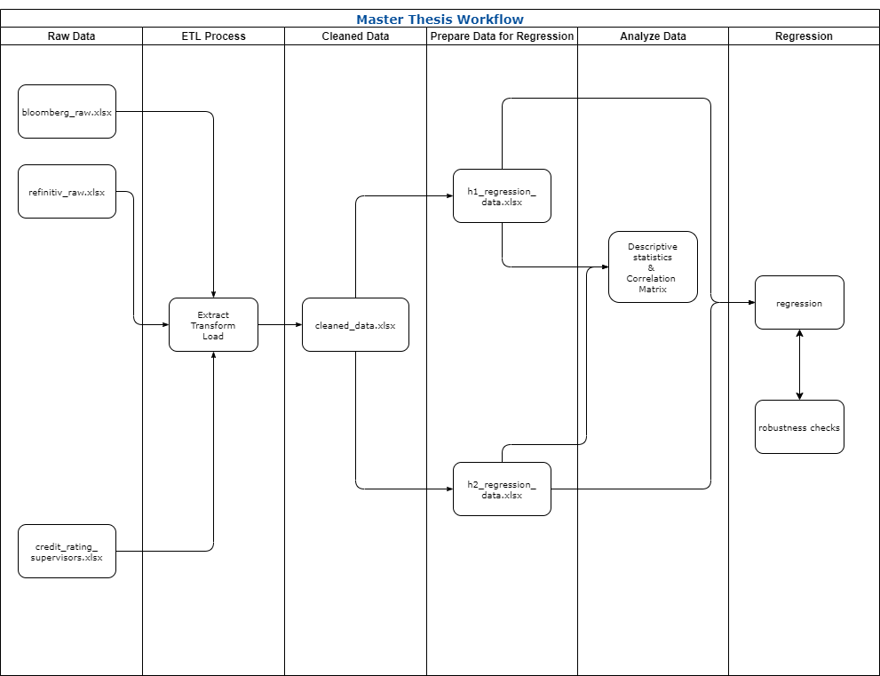

# MASTER THESIS
# ESG Ratings and Credit Ratings: Is there an Informational Overlap?

**Submitted to:**

Prof. Loriana Pelizzon, Ph.D.  
Goethe University Frankfurt  
Chair of Law and Finance  
Frankfurt am Main

**by:**

Uyen Huynh  
s4584479@stud.uni-frankfurt.de  
M.Sc. International Management  
Summer Term 2021  

## 1. Data Sources
Data used in the thesis (2006 - 2020) is collected from three sources:  
* Bloomberg Terminal
* Eikon DataStream (Refinitiv)
* data provided by my supervisors (Ms. Zorka and Mr. Carmelo)
### 1.1. Bloomberg Terminal
Following data is retrieved and saved under ```data/raw_data/bloomberg_raw.xlsx```:
* ESG percentile ranks from Sustainalytics and S&P Global (formerly RobecoSAM)
* S&P credit rating changes
* yearly accounting data  
### 1.2. Refinitiv
Following data is retrieved and saved under ```data/raw_data/refinitiv_raw.xlsx```:
* ESG scores from Refinitiv
### 1.3. From supervisors
Following data is received and saved under ```data/raw_data/credit_rating_supervisors.xlsx```:
* S&P credit ratings from 1980 to 2015

## 2. Workflow
The workflow of the thesis is as follows:  



### 2.1. Clean Data - ETL (Extract - Transform - Load) Process
This process is done in ```lib/clean_data.py``` and includes the following steps:
* Extract raw data from downloaded Excel files (as mentioned in Section 1.)
* Transform raw data from wide to long format
* Load (write) the transformed data to Excel file ```data/cleaned_data/cleaned_data.xlsx```

*Note*: This ETL process is done separately for each data source.

### 2.2. Prepare Data for Regression
This process is done in ```lib/prepare_data.py``` and includes the following steps:
* For hypothesis 1:
    * merge ESG ratings data of each provider with credit ratings and accounting data
    * drop rows where there is at least one NA value
      
* For hypothesis 2:
    * merge credit ratings with ESG ratings of all providers and accounting data
    * only drop rows where accounting data contains NA values
    
